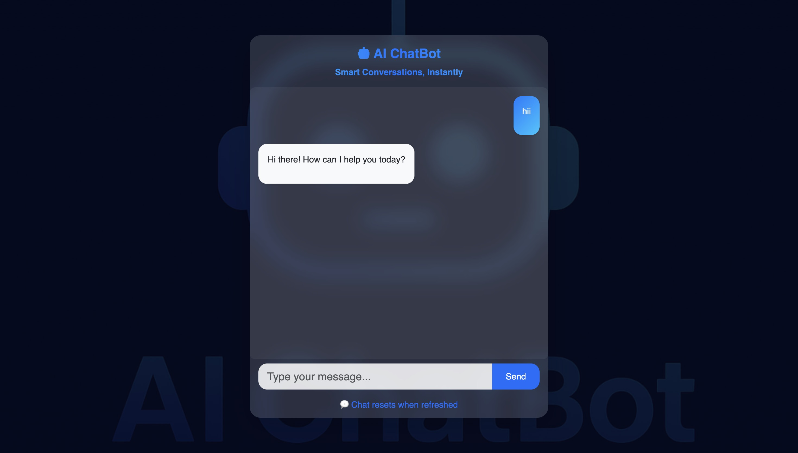

# 🤖 AI ChatBot — Powered by Google Gemini API

A full-stack **AI ChatBot** built using **React (Vite)** for the frontend and **Node.js + Express + MongoDB** for the backend.
The chatbot uses **Google Gemini (Generative AI)** to generate intelligent, contextual responses to user messages.

---

## 🌍 Live Deployment

| Service     | Link                             |
| ----------- | -------------------------------- |
| 🖥️ Frontend | https://ai-chatbot001.vercel.app |

---

## 📸 UI Preview

| Home                                 | Live                                   |
| ------------------------------------ | -------------------------------------- |
|  |  |

---

## 🧩 Features

✅ Real-time AI chat using **Google Gemini API**
✅ Message persistence with **MongoDB**
✅ Clean and responsive UI (Bootstrap 5)
✅ Markdown rendering for formatted AI responses
✅ Error handling for API rate limits and server failures

---

## 🚀 Tech Stack

### 🧠 Backend (Server)

- Node.js (ESM)
- Express.js
- MongoDB + Mongoose
- Google Generative AI (`@google/generative-ai`)
- dotenv
- CORS

### 💬 Frontend (Client)

- React (Vite)
- Axios
- Bootstrap 5
- React Markdown (for rendering AI responses)

---

## 🏗️ Folder Structure

```
ai-chatbot/
├── server/
│   ├── config/
│   │   └── db.js
│   ├── controllers/
│   │   └── chatControllers.js
│   ├── models/
│   │   └── chatModel.js
│   ├── routes/
│   │   └── chatRoutes.js
│   ├── index.js
│   ├── server.js
│   └── package.json
│
└── client/
    ├── src/
    │   ├── App.jsx
    │   ├── main.jsx
    │   └── index.css
    ├── vite.config.js
    └── package.json
```

---

## ⚙️ Setup Instructions

### 🖥️ Backend Setup

1. Navigate to the **server** folder:

   ```bash
   cd server
   ```

2. Install dependencies:

   ```bash
   npm install
   ```

3. Create a `.env` file in the `server` folder:

   ```bash
   GEMINI_API_KEY=your_google_gemini_api_key
   DB_URI=your_mongodb_connection_string
   PORT=3000
   ```

4. Start the backend server:

   ```bash
   npm run dev
   ```

> The backend will start at `http://localhost:3000`

---

### 💻 Frontend Setup

1. Navigate to the **client** folder:

   ```bash
   cd client
   ```

2. Install dependencies:

   ```bash
   npm install
   ```

3. Start the frontend:

   ```bash
   npm run dev
   ```

> The client will run at `http://localhost:5173` (Vite default)

---

## 🔌 API Endpoint

### POST `/api/chat`

**Description:** Sends a user message to the Gemini API and receives a chatbot response.

**Request:**

```json
{
  "message": "Hello, how are you?"
}
```

**Response:**

```json
{
  "success": true,
  "message": "Chat stored successfully and response generated",
  "chat": {
    "_id": "670c57f1...",
    "userMessage": "Hello, how are you?",
    "botMessage": "Hi there! I'm doing great — how can I help you today?",
    "timestamp": "2025-10-18T..."
  }
}
```

---

## 🛡️ Environment Variables

| Variable         | Description                       |
| ---------------- | --------------------------------- |
| `GEMINI_API_KEY` | Your Google Generative AI API key |
| `DB_URI`         | MongoDB connection string         |
| `PORT`           | Server port (default: 3000)       |

---

## 🧠 How It Works

1. The **frontend** captures user input and sends it via `axios` to `/api/chat`.
2. The **backend** passes the message to the **Google Gemini model**.
3. The **AI response** and user message are stored in **MongoDB**.
4. The **frontend** displays both messages in a chat UI using ReactMarkdown for formatting.

---

## 🖼️ Preview

| User                | Bot                                                                         |
| ------------------- | --------------------------------------------------------------------------- |
| You: What is React? | Bot: React is an open-source JavaScript library for building UI components. |

---

## 🚀 Deployment

- **Frontend:** Deployed on [Vercel](https://vercel.com/)
- **Backend:** Deployed on [Render / Railway / Vercel Functions]
- **Database:** MongoDB Atlas

---

## 📦 Scripts

### Server

```bash
npm run dev    # Start backend with nodemon
```

### Client

```bash
npm run dev    # Run Vite development server
npm run build  # Build for production
npm run preview # Preview production build
```

---

## 💡 Future Enhancements

- ✅ Add user authentication (JWT)
- ✅ Implement chat history with pagination
- ✅ Add multi-model support (Gemini / OpenAI)
- ✅ Dark mode UI

---

## 🧑‍💻 Author

**Abdul Kalam**
💼 [GitHub](https://github.com/Abdul-Kalam0/AI-ChatBot) • 🌐 [Live Project](https://ai-chatbot001.vercel.app)

---

## 📄 License

This project is licensed under the **MIT License** — feel free to use and modify it.

---

### ⭐ If you like this project, consider giving a **GitHub Star**!

Made with ❤️ by Abdul Kalam
