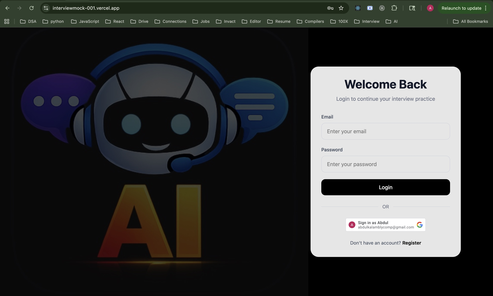
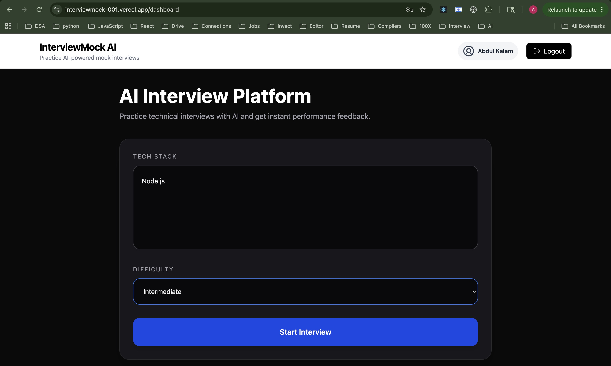
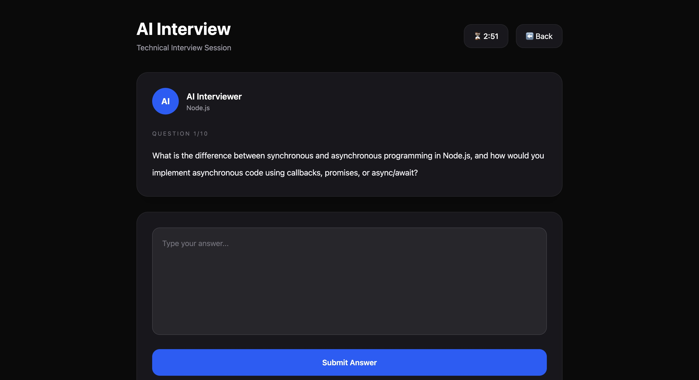
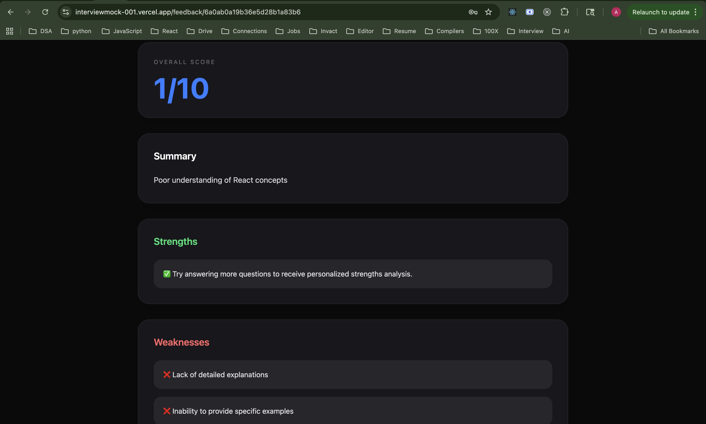

# 🚀 AI Mock Interview Platform

AI Mock Interview Platform is a full-stack AI-powered web application that helps users practice technical interviews in a real-world interview environment using AI-generated questions and intelligent feedback analysis.

---

## 🌐 Live Demo

🔗 https://interviewmock-001.vercel.app

---

## 📌 Features

- 🔐 Authentication (JWT + Google OAuth)
- 🍪 Secure HTTP-only Cookie Authentication
- 🛡️ Protected Routes & APIs
- 🤖 AI-generated Technical Interview Questions
- ⏳ Real-time Timed Interview Sessions
- 📊 AI-generated Feedback & Performance Analysis
- 🎯 Difficulty-based Interview Flow
- 📱 Fully Responsive UI
- 🎨 Modern SaaS-style Interface
- 🔒 Rate Limiting & API Security

---

## 🛠️ Tech Stack

### Frontend

- React (Vite)
- Tailwind CSS
- React Router DOM
- Axios
- React Toastify

### Backend

- Node.js
- Express.js
- MongoDB (Mongoose)

### Authentication

- JWT (HTTP-only cookies)
- Google OAuth

### AI Integration

- Gemini API

### Deployment

- Frontend: Vercel
- Backend: Vercel

---

## 📸 Screenshots

### Login



---

### Dashboard



---

### Interview Page



---

### Feedback Page



---

## 📁 Folder Structure

```bash id="yzb0hb"
AI-Mock-Interview/
│
├── client/
│   ├── src/
│   ├── components/
│   ├── context/
│   ├── pages/
│   ├── routes/
│   ├── services/
│
├── server/
│   ├── controllers/
│   ├── middleware/
│   ├── models/
│   ├── routes/
│   ├── utils/
│
└── README.md
```

---

## ⚙️ Installation & Setup

### 1️⃣ Clone the repository

```bash id="d3q2f5"
git clone https://github.com/your-username/AI-Mock-Interview.git

cd AI-Mock-Interview
```

---

### 2️⃣ Setup Backend

```bash id="cc5lti"
cd server

npm install
```

Create `.env` file:

```env id="hzk6ho"
PORT=5000

MONGO_URI=your_mongodb_uri

JWT_SECRET=your_secret

GOOGLE_CLIENT_ID=your_google_client_id

GEMINI_API_KEY=your_gemini_api_key
```

Run backend:

```bash id="o6v8lw"
npm run dev
```

---

### 3️⃣ Setup Frontend

```bash id="rxshlw"
cd client

npm install
```

Create `.env` file:

```env id="x67zpq"
VITE_API_URL=http://localhost:5000/api

VITE_GOOGLE_CLIENT_ID=your_google_client_id
```

Run frontend:

```bash id="22k31p"
npm run dev
```

---

## 🔐 Authentication Flow

### Email/Password Login

- User logs in → JWT token stored in HTTP-only cookies
- Protected routes validated using `/auth/me`

### Google OAuth

- User logs in using Google
- Backend verifies Google credential
- JWT cookie is issued after verification

---

## 📡 API Endpoints (Sample)

```bash id="9nzwqa"
POST   /auth/register
POST   /auth/login
POST   /auth/google
POST   /auth/logout
GET    /auth/me

POST   /interview/start
POST   /interview/answer

GET    /interview/summary/:interviewId
```

---

## 🏗️ Architecture & Security

- 🏗️ Scalable MERN architecture
- 🍪 Cross-origin secure cookie authentication
- 🛡️ Rate limiting for authentication routes
- 🔒 Protected backend APIs using JWT middleware
- ⚡ Optimized frontend routing with protected/public routes

---

## 📊 Project Highlights

- ⚡ Built multiple REST APIs
- 🤖 Integrated Gemini AI for dynamic interview generation
- 🔐 Secure authentication using JWT + OAuth
- ⏳ Real-time timed interview workflow
- 📊 Automated AI feedback and scoring system
- 🎨 Production-grade SaaS-inspired UI/UX
- 🚀 Deployed with cross-origin cookie handling

---

## 🧠 Learnings

- Full-stack MERN architecture
- Authentication & authorization
- Cross-origin cookie handling
- AI-integrated applications
- REST API design
- State management & protected routing
- Modern UI/UX design with Tailwind CSS
- Deployment & production environment handling

---

## 🚧 Future Improvements

- 🎤 Voice-based AI Interviews
- 📹 Video Interview Support
- 📈 User Analytics Dashboard
- 🧠 Advanced AI Evaluation
- 🌍 Multi-language Support
- 🏆 Leaderboard & Rankings

---

## ⭐ Show Your Support

If you found this project useful:

👉 Star ⭐ this repository
